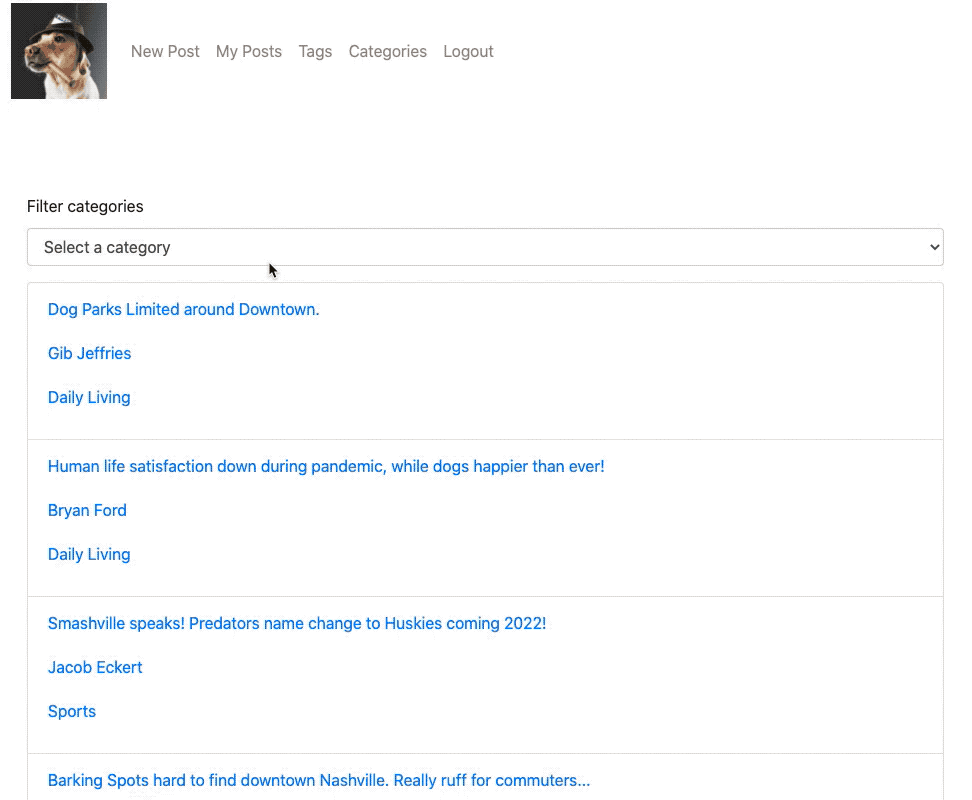
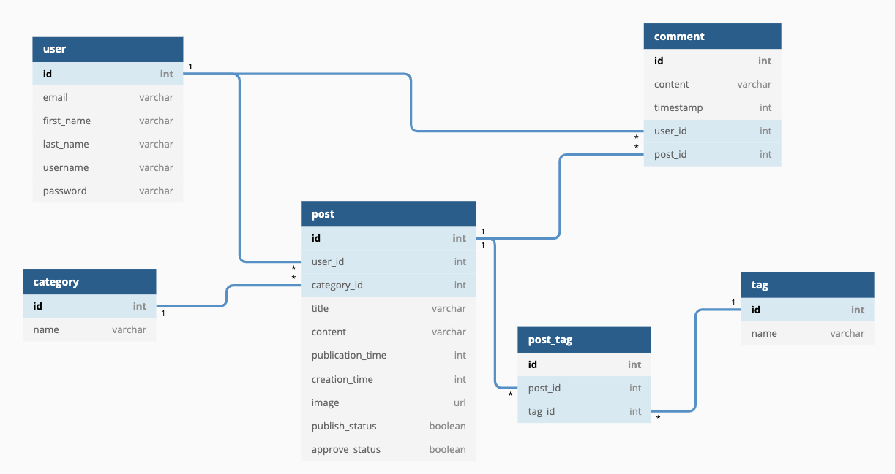

# Rare: The Puplishing Platform for the Discerning Doggo

This is a learning project. Our goals were to practice full stack development by creating a react client and python-sql back end.

This project was completed in a 6 day Agile-SCRUM sprint. At the start of the project we met with our project manager and assigned point scales to the enhancement tickets based on our estimates of the workload.

As a team, we decided to implement the react-bootstrap styling library on this project. This allowed us to create a consistent appearance across the site.

## Installation Instructions 
Requirements:
- Python 3.8.1 (One option is to install pyenv to manage python versions)
- pipenv `pip3 install --user pipenv`
- watchgod `pip install watchdog`

Installation steps

1. If you haven't already, visit https://github.com/NSS-Day-Cohort-42/rare-news-hounds, and follow the readme there to set up the client side of the application.
1. Create a new directory for this project, and use the terminal to clone the project directory there: `git clone https://github.com/NSS-Day-Cohort-42/rare-server-news-hounds.git`
1. Run `pipenv shell` to create a new virtual environment 
1. Run `pipenv install watchgod` to install
1. Once you are running the sample database, create a new user, and log in to view the site. 🦮 Good Boy!!!🦮 Give yourself a treat!🦮 

## User Experience

Here is a quick overview of the user experience! Users can create posts, filter them by category, and add tags.

## Database Planning

Here is our Entity Relationship Diagram for this project. 

